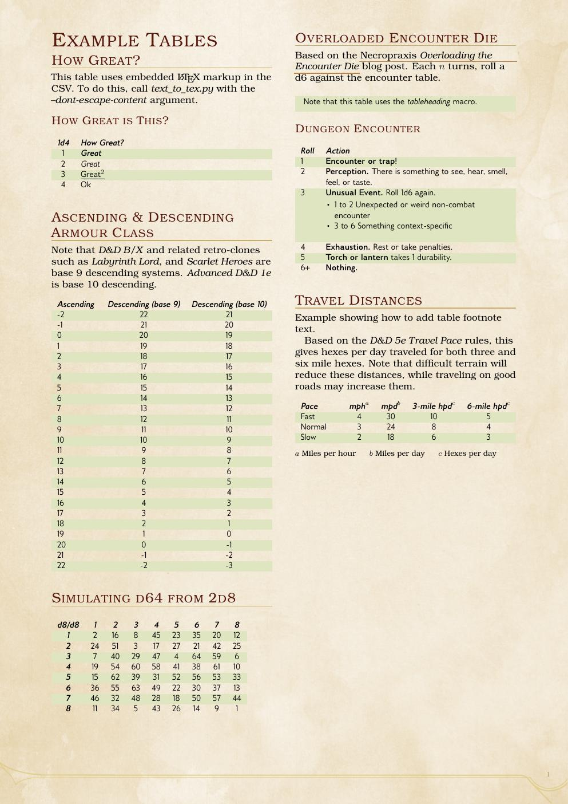

# dnd-table-maker

Utility for generating formatted tables from text files in the style of the
fifth edition of the *world's greatest roleplaying game* courtesy of the lovely
[DnD 5e LaTeX Template](https://github.com/rpgtex/DND-5e-LaTeX-Template).

## Command-line Arguments

```text
usage: text_to_tex.py [-h] [-d] [-i INPUT] [-o OUTPUT] [-p LABEL_PREFIX]
                      [-l DELIMITER] [-x] [-n] [-v] [-r]

optional arguments:
  -h, --help            show this help message and exit
  -d, --dont-escape-content
                        Don't escape LaTeX symbols in the row content. Allows
                        LaTeX markup in the input file
  -i INPUT, --input INPUT
                        Input file
  -o OUTPUT, --output OUTPUT
                        Output file
  -p LABEL_PREFIX, --label-prefix LABEL_PREFIX
                        Label prefix
  -l DELIMITER, --delimiter DELIMITER
                        Input file delimiter. Default is the pipe symbol |
  -x, --no-name         Do not emit a table name/header/section at all.
  -n, --name-as-header  Embed the table name as a header in the table rather
                        than using the \tableheading macro
  -v, --version         Print the version number and exit.
  -r, --no-format-first-row
                        Do not apply formatting to the first content row.
```

## LaTeX Macros

You should define these two macros in your LaTeX file. They allow you to control
the appearance of the table headings and column headings. A minimal working example
can be found in `header.tex`.

```tex
\newcommand\tableheading[1]{\subsubsection{#1}}
\newcommand\columnheader[1]{\textbf{\emph{#1}}}
```

## Input File Format

See the sample files in `csv/` for input file examples, and
`example.tex` for a minimal example of using the generated tex files to create a document.

### Embedded Options

In addition to command-line arguments, the script also supports per-file options
embedded in the first line of the CSV file. Currently supported options are:

* **no-name** As per the script argument.
* **name-as-header** As per the script argument.
* **no-format-first-row** As per the script argument.
* **no-default-numbers** Don't output default numbers for table entries that are
  missing a number.
* **emit-label** Emit a LaTeX label for the table. The label name is the value
  supplied to LABEL_PREFIX combined with the table name.

## Examples

`example.tex` and the input files in `csv/` can be compiled into an example PDF
with the `make example` command. Here's the first page:


